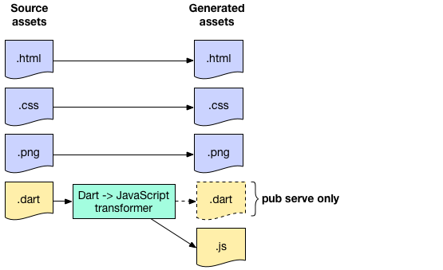

# Pub 包管理器
http://www.cndartlang.com/929.html

在Dart SDK中，包含了自己的包管理工具Pub。你可以使用Pub工具来管理包和资源，并且Pub还包含创建、开发、部署应用的命令。

关于包的概念，实质上就是一个目录（至少包含一个pubspec.yaml配置文件）。它可以包含各种内容，如代码、资源、测试、文档等。库（library）和应用（application）都是包。库是用来被重用的代码，包含了需要被别人导入的代码。而应用只是使用其它包实现自己的功能。

**Dart应用依赖于包。如果你的Dart应用使用一个或多个包，那么你的应用本身一定是一个应用包。**

## 1、Pub入门

前面提到pubspec.yaml，该文件包含了包的元数据，如包的名称。最简单的pubspec只有name元数据。需要注意的是，pubspec必须位于应用的顶层，即根目录。

如果应用引用了其他包，那么必须在pubspec中设置依赖，如：
```yaml
name: my_app
dependencies:
  js: ^0.3.0
  intl: ^0.12.4
```
包名后面配置的是版本约束信息，它由一组空格分隔的版本描述组成，具体如下：

版本|说明
---|---
any | 任意版本。
1.2.3 | 只能是这个特定的版本。尽量避免这样用，因为你的包依赖了某个特定版本的包，如果别人要使用你的包并且他们本身也直接或间接也依赖那个包的其他版本，可能会发生冲突。
>=1.2.3 |    大于等于指定版本，经常使用。
>1.2.3 | 大于指定版本，但不包括该版本。
<=1.2.3 | 小于等于指定版本，不常用。
<1.2.3 | 小于指定版本，但不包括该版本，经常使用。比如你发现某个版本开始，出现了不兼容的变化，但你又依赖之前版本的时候。


同时，你也可以使用空格分隔符，指定版本的范围。例如，>=1.2.3 <2.0.0，而更简单的办法是使用Caret语法^1.2.3。

> 注：由于元数据与名称使用空格分隔，因此版本号中不能使用空格。同时，’>’大于符号也是YAML语法中的符号。因此在指定范围的时候，必须使用引号，如：’>=1.2.3 <2.0.0’。

Caret语法是怎么回事？当你添加依赖的时候，可能希望指定一个允许的版本范围。你如何选择范围？你需要向前兼容，希望范围包含将来的还未发布的版本。但是怎么知道对于还未存在的新版本，运行是否正常呢？

为了解决此问题，需要在版本号的定义上达成一致。想想一下，某个包的开发商说：“如果我们做什么不向后兼容的改变，那么我们承诺增加主版本号。”如果你信任他们，如果你确定你的包在依赖2.5.7版本时运行正常，那么你可以一直依赖它，直到3.0.0版本。

Caret语法提供了表示版本约束的更简洁的方法，^version表示向后兼容到指定版本的范围。例如，^1.2.3等同于‘>=1.2.3 <2.0.0’，^0.1.2等同于‘>=0.1.2 <0.2.0’。

```yaml
dependencies:
  path: ^1.3.0
  collection: ^1.1.0
  string_scanner: ^0.1.2
```
需要注意的是，Caret语法是Dart 1.8.3版本中添加的功能。所以，建议你使用传统语法对SDK进行约束。例如：
```yaml
environment:
  sdk: '>=1.8.3 <2.0.0'
```
配置好pubspec后，可以在应用的根目录运行pub get命令来下载安装包：
```
cd <path-to-my_app>
pub get
```
该命令会确定你应用依赖的包，并将包存入系统缓存中。在Mac和Linux中，缓存目录默认是~/.pub-cache。在Windows中，位于AppData\Roaming\Pub\Cache。可以通过设置PUB_CACHE环境变量对缓存目录进行修改。

dependencies中可以设置数据源。对于git，pub会克隆git仓库。对于hosted依赖，pub会默认是从pub.dartlang.org下载包。同时，pub会下载包依赖的其他包。例如，如果js包依赖test包，那么pub在抓取js包的时候，会同时下载test包。

接下来，pub创建一个或多个packages目录，包含包的符号链接。然后，pub在应用的根目录创建.packages文件，将依赖的包名与系统缓存中的包进行映射。最后，pub会创建pubspec.lock文件，它记录了当前应用直接或间接依赖的所有包及其当前使用的版本。如果你的包是一个应用，那么应该把它提交到源码版本管理中，这样别人在使用这个应用时会使用和你完全一样的包。如果你的包是一个库，那么不要把它提交到源码版本管理中。

### Dev dependencies
Pub支持两种类型的依赖：常规依赖和Dev依赖。区别在于，你依赖包的时候，包中的Dev依赖会被忽略。例如，假设my_package使用了test包，仅用于my_package本身的测试。如果用户依赖引用该包，实际上并不需要test包。这种情况下，可以指定test包为Dev依赖。具体写法如下：
```yaml
dev_dependencies:
  test: '>=0.5.0 <0.12.0'
```
如何决定依赖类型？很简单，一般如果包用于lib或bin目录的代码，依赖非常重要，那么使用常规依赖。如果仅用于test、example等功能目录，应该使用Dev依赖。使用Dev依赖可以使依赖图更小，使Pub运行更快，并且更容易查找满足约束条件的包。

### 重写dependency
你可以使用dependency_overrides 暂时覆盖所有引用的依赖。例如，假设你准备修改一个已经发布的transmogrify包的依赖。在你的应用依赖中，transmogrify包被其他的包使用。你并不想一一更新pubspec。在这种情况下，你可以使用dependency_overrides用指定目录的依赖覆盖。

```yaml
name: my_app
dependencies:
  transmogrify: ^1.2.0
dependency_overrides:
  transmogrify:
    path: ../transmogrify_patch/
```
当你运行pub get的时候，pubspec.lock文件会更新依赖到新的路径，无论在何处使用transmogrify，Pub都会使用指定的包代替。除了指定路径，你也可以指定某版本：
```yaml
name: my_app
dependencies:
  transmogrify: ^1.2.0
dependency_overrides:
  transmogrify: '3.2.1'
```
> 注：重写依赖存在一定的风险。例如，重写的版本不在包支持的版本范围，或指定本地的副本不兼容时，可能出现意外情况，使程序崩溃。

## 2、Asset资源和Transformer转换器

在启动应用服务之前，pub serve、pub build、pub run等命令使用transformer转换器配置包的asset资源，来为部署工作构建应用，或执行命令行应用。

```yaml
name: myapp
dependencies:
  polymer: ^0.16.3
transformers:
- polymer:
    entry_points:
    - web/index.html
- web/index2.html
```
包的资源可以放在任意目录中。但是，如果你想有效的发布资源（应用于其他包，或包的多个目录中），那么它需要放在lib文件夹中。

当pub build转换后，资源在build中使用有效。例如，对于下面的目录结构：
```yaml
myapp/
  example/
    foo/
      bar.txt
```
当运行pub build example命令后，会生成资源，得到build/example/foo/bar.txt文件。

### 转换器如何工作
下面是转换器的一些实例：

- dart2js，读取.dart文件，并编译生成.js文件。
- polymer，优化HTML和Dart文件。
- linter，读入文件并生成警告，但没有生成文件。

你并不用明确转换器应用于哪些资源，每个转换器可以自己确定。对于pub serve，当服务启动以及任何时候资源发生变化时，转换器运行。而pub build和pub run命令只运行转换器一次，然后退出。

如下图所示，Source资源可以通过直接（如图片、文本）或转换（如.dart文件）的形式生成资源。



Dart文件是一个特殊情况。pub build命令不会生成.dart文件，因为通常浏览器并不原生支持Dart。另一方面，pub serve命令会生成.dart资源，你可以在开发期间使用Dartium。

某些情况下我们需要指定转换器，下面是在使用Polymer时的转换器配置配置：
```yaml
name: myapp
dependencies:
  polymer: ^0.16.3
transformers:
- polymer:
    entry_points: web/index.html
```
当运行pub serve、pub build、pub run命令的时候，可以对dart2js转换进行设置，以分析代码：

```yaml
transformers:
- $dart2js:
    analyzeAll: true
```
预计以后会有更多的转换器。你可以指定多个转换器并行（如果它们是相互独立的）或在不同的阶段运行。指定转换器并行运行，语法为[transformer_1, …, transformer_n]，否则会以每行按顺序运行。例如：
```yaml
transformers:
- [t1, t2]
- t3
```
Pub build隐式的附加了一个转换器，将Dart代码转换为JavaScript，以便代码能够在现代浏览器中运行。

### 引用资源

资源可以放在包的根目录中。但是，资源位于lib文件夹中时，具有额外的特性：

- 其它包依赖的资源需放在lib目录中。
- 你包中的资源，如果希望从包中的其它目录访问，需放在lib目录中。
- lib/src中的资源，对于其它的包是不可见的。

> 注：在早期的版本中，资源位于根目录的asset目录。但现在Pub已经不再识别该目录。

下面是供参考的应用的Source资源结构，main Dart文件位于web目录，其他的Dart文件位于lib目录。

```
app/
  lib/
    *.dart
    *.png
    *.html
    ...
  packages/
    pck/
      lib/
        *.dart
        *.js
  web/
    app.dart
    *.html
    *.css
    *.png
...
```
转换后，pub build会在build目录中生成资源，资源的名称不变。例如，对于Web应用（源码位于/web目录），Pub会创建一个build/web目录。

> 注：默认情况下，pub build会假设正在构建的是Web应用。如果pub build后不跟其他参数，并且根目录并没有web目录，Pub会产生一个错误。

对于未转换的资源，下面是Source资源与生成的资源相关联的位置：

Source资源位置	|Generated资源位置（build目录）
---|---
`…/<your_pkg>/web/<path>` |	`/web/<path>`
`…/<your_pkg>/lib/<path>`	 |`/packages/<pkg_name>/<path>`

例如，假设helloworld的HTML文件在helloworld目录中的路径为web/helloworld.html。运行pub build生成副本，路径为build/web/helloworld.html。访问的URL为http://localhost:8080/helloworld.html。如果你包含了其他的库（如lib文件夹中的库或依赖browser），则构建的路径为build/web/packages/…。

需要注意的是，转换器可能会改变`<path>`的任意部分，特别是文件名，但是它们并不会改变`<path>`的上层目录结构。

### 选择需要处理的资源

你可以使用$exclude告诉转换器不处理某资源，$include指仅处理某资源。同时，你也可以使用Glob语法来包含、排除一组资源，包括整个目录。例如：

```yaml
transformers:
- simple_transformer:
    $exclude: "lib/foo.html"
```
你必须提供文件在包的顶层目录中的位置。需要注意的是，转换器的参数名前面缩进有4个空格，冒号后有1个空格分隔符。

你可以使用文件名列表来包含、排除资源：
```yaml
$exclude: ["lib/foo.html", "lib/bar.html"]
```
仅处理包中所有以.txt结尾的文件：
```yaml
transformers:
- my_transformer:
    $include: **.txt
```

或者忽略指定文件夹中的文件：
```yaml
transformers:
- my_transformer:
    $exclude: lib/untransformed
```
如果你发布了一个包，并且使用了Glob语法。但是，早期版本的Pub并不能正确识别。为了保证使用兼容版本的Pub，建议在pubspec中添加SDK约束。
```yaml
environment:
  sdk: ">=1.8.0 <2.0.0"
```
如果你的项目包含了其他人写的不严谨的Dart文件lib/lax_code.dart，当运行pub build或pub serve时，对于那些文件可能出现dart2js的编译警告信息，你可以禁止输出警告信息：
```yaml
transformers:
- $dart2js:
    suppressWarnings: true
    $include: "lib/lax_code.dart"
- $dart2js:
    suppressWarnings: false
    $exclude: "lib/lax_code.dart"
```

## 3、Pub Global命令
Pub工具提供了许多的功能，这里仅聊一下pub global这个命令。当你不在包内部的时候，Global选项允许你从命令行运行Dart脚本。激活包后，可以从那个包的bin目录运行脚本。停用包时，从全局可用包列表中删除。

### 激活包
使用activate可以让你在任意的路径运行包中的可执行文件，你可以激活pub.dartlang.org、Git仓库或本地中的包。
```cmd
pub global activate [--noexecutables] [--executable=<name>] [--overwrite] <package> [constraint]
```
默认激活的是pub.dartlang.org上的包。
```
pub global activate <pub.dartlang package>
```
例如，指定激活pub.dartlang.org上的markdown包：
```
pub global activate markdown
```
激活Git仓库中的包。
```
pub global activate --source git <Git URL>
pub global activate -sgit <Git URL>
```
例如，激活Github上的async_await包：
```
pub global activate --source git https://github.com/dart-lang/async_await.git
pub global activate -sgit https://github.com/dart-lang/async_await.git
```
激活本地的包。
```
pub global activate --source path <path>
```

例如，从~/dart目录激活stopwatch包：
```
pub global activate --source path ~/dart/stopwatch
```
一旦一个包已经被激活，你可以通过再一次activate来进行升级更新。

### 运行脚本
你可以使用pub global run来运行已经激活的包中的脚本，或者你可以将它添加到PATH，以便可以在命令行隐式地调用。
```
pub global run <package>:<executable> [args...]
```
你可以指定运行的参数，下面的命令是运行foo包中的bin/bar.dart脚本，并传入两个参数：
```
pub global run foo:bar arg1 arg2
```
包可以在pubspec文件中列出可执行的入口，选择需要暴露的可执行脚本。例如，在下面的配置中，运行helloworld会执行bin/main.dart。如果不指定值，则会默认以key作为值，即运行say会执行bin/say.dart
```yaml
name: helloworld
executables:
  helloworld: main
  say:
```

当激活该包后，Pub会在缓存的bin目录（Linux和Mac默认为~/.pub-cache/bin，Windows默认为AppData\Roaming\Pub\Cache\bin）中为每个可执行文件创建执行脚本（Windows为bat脚本）。如果你只想激活部分可执行脚本，可以使用参数`–executable=<name>` (或者简写 `-x<name>`)。

如果你不想每次运行的时候都使用pub global run命令，你必须手动将Pub缓存的bin目录添加到PATH中。现在你可以直接在命令行运行helloworld或say了。

如果可执行脚本的名称与之前激活的脚本发生冲突，会产生警告。为了强制Pub安装新的可执行脚本，可以使用–overwrite参数。例如：
```
pub global activate <package> --executable=<name> --overwrite
```

### 停用包
使用deactivate参数可以将激活的包从全局可用包列表中删除。
```
pub global deactivate <package>
```
例如，停用之前激活的markdown包：
```
pub global deactivate markdown
```
### 显示已激活的包
使用list参数显示当前激活的所有包。
```
pub global list
```

### 参数选项

#### constraint
约束。pub global activate命令的可选参数，用于拉取指定版本的包。例如，下面的命令是拉取0.6.0版本的markdown包：
```
pub global activate markdown 0.6.0
```
如果指定的是一个范围，那么Pub会选择最佳的符合约束条件的版本，例如：
```
pub global activate foo <3.0.0
```

#### `–executable=<name>` 或 `-x<name>`
pub global activate命令的可选参数，用于添加指定的可执行脚本到PATH中，该参数可以使用多次。例如，下面的命令是添加bar和baz到PATH中。
```
pub global activate foo -x bar -x baz
```

#### –no-executables
pub global activate命令的可选参数，用于全局激活包，但并不在缓存bin目录中创建任何可执行脚本，因此必须使用 pub global run来运行可执行脚本。

#### –overwrite
pub global activate命令的可选参数。通常情况下，如果两个全局包的可执行脚本名称发生冲突，不会覆盖之前的脚本。如果你指定该参数，新的脚本会覆盖之前激活的可执行脚本。

## Pub 镜像安装帮助

Pub 是 Dart 官方的包管理器。跨平台的前端应开发 框架 Flutter 也基于 Dart 并且可以使用大部分 Pub 中的 库。

如果希望通过 TUNA 的 pub 镜像安装软件，只需要设置 PUB_HOSTED_URL 这个环境变量指向 https://mirrors.tuna.tsinghua.edu.cn/dart-pub/ 即可。

以 bash 为例，临时使用 TUNA 的镜像来安装依赖：
```
$ PUB_HOSTED_URL="https://mirrors.tuna.tsinghua.edu.cn/dart-pub/" pub get # pub
$ PUB_HOSTED_URL="https://mirrors.tuna.tsinghua.edu.cn/dart-pub/" flutter packages get # flutter
```
若希望长期使用 TUNA 镜像：
```
$ echo 'export PUB_HOSTED_URL="https://mirrors.tuna.tsinghua.edu.cn/dart-pub/"' >> ~/.bashrc
```


```
我这个是下载失败，可以多尝试几次，下载完成后，继续输入

export PUB_HOSTED_URL=https://pub.flutter-io.cn

再输入：

export FLUTTER_STORAGE_BASE_URL=https://storage.flutter-io.cn

PUB_HOSTED_URL和FLUTTER_STORAGE_BASE_URL都是针对国内不能访问国外网络而设置的镜像
```